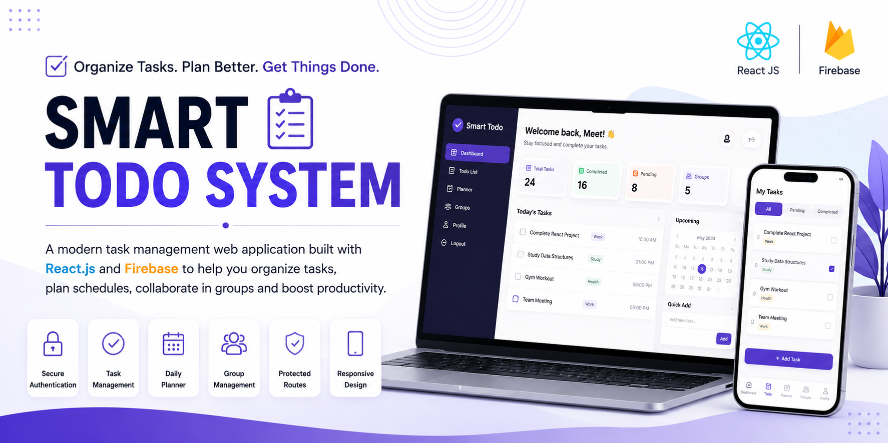

<p align="center">
  
</p>

<h1 align="center">✅ Smart Todo System</h1>

<p align="center">
A modern task management web application built with React.js and Firebase to help users organize tasks, plan schedules, collaborate with groups, and boost productivity.
</p>

---

## 🚀 Live Demo

🌐 **Smart Todo System**

https://smart-todo-system-app.netlify.app/

---

## 🛠️ Tech Stack

### 🎨 Frontend

- React.js
- HTML5
- CSS3
- JavaScript
- React Router DOM

### 🔥 Backend & Database

- Firebase Authentication
- Cloud Firestore

---

## ✨ Features

- 🔐 Secure Login & Signup
- ✉️ Email OTP Verification
- 🔑 Forgot Password
- ✅ Create, Update & Delete Tasks
- 📅 Daily Planner
- 👥 Group Management
- 🔒 Protected Routes
- 📱 Responsive Design
- ⚡ Fast & User-Friendly Interface

---

## 📂 Project Structure

```text
Smart-todo-system
│
├── public
├── src
│   ├── components
│   ├── firebase
│   ├── css
│   └── assets
│
├── package.json
└── README.md
```

---

## 📸 Preview

> Screenshots will be added soon.

---

## 📥 Installation

Clone the repository

```bash
git clone https://github.com/Meet-Kanakiya/Smart-todo-system.git
```

Navigate to the project folder

```bash
cd Smart-todo-system
```

Install dependencies

```bash
npm install
```

Start the development server

```bash
npm run dev
```

---

## 📚 What I Learned

- Building Single Page Applications with React.js
- Firebase Authentication
- Cloud Firestore Database
- Protected Routes
- State Management using React Hooks
- CRUD Operations
- Component-Based Architecture
- Responsive UI Design
- Real-world Project Structure

---

## 🎯 Purpose

This project was developed to improve my frontend development skills and gain practical experience with authentication, task management, and Firebase integration while building a real-world productivity application.

---

## 📬 Contact

💼 LinkedIn

https://www.linkedin.com/in/meet-kanakiya-a5b951367/

💻 GitHub

https://github.com/Meet-Kanakiya

---

## 👨‍💻 Developed By

**Meet Kanakiya**

Computer Engineering Student

Passionate about Full Stack Development, Python, and building real-world web applications.

⭐ If you found this project useful, consider giving it a Star!
